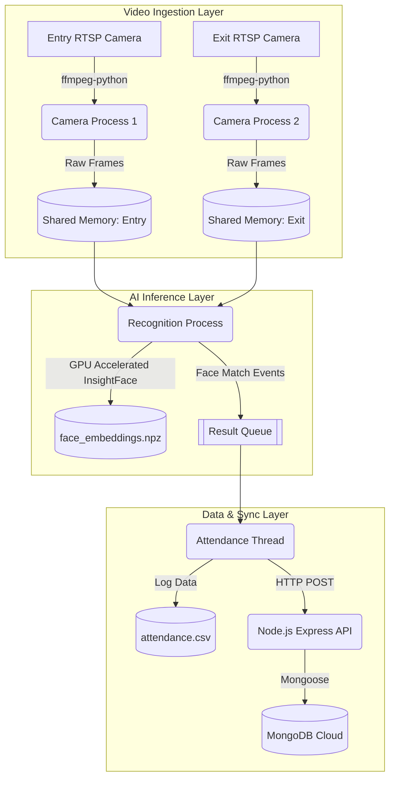

# Technical Documentation: Biometric Attendance Application

## 1. Application Overview and Architecture
The Biometric Attendance Application is a distributed, multi-process system designed to perform real-time face recognition on multiple IP camera streams (Entry and Exit). It captures video feeds, identifies employees using advanced Deep Learning models, calculates attendance durations, and synchronizes the records with a local CSV and a remote MongoDB database via a Node.js backend.

### High-Level Architecture
The architecture is logically divided into three primary components:
1. **Video Ingestion Layer**: Connects to RTSP streams using FFmpeg and writes raw video frames into Python Shared Memory.
2. **AI Inference Layer**: Reads from Shared Memory and utilizes the InsightFace framework (ONNX Runtime) to detect and recognize faces against pre-trained embeddings.
3. **Data & Synchronization Layer**: Records timestamps, calculates durations, saves locally to a CSV, and posts the data to the Node.js/MongoDB Backend via REST APIs.

#### Operational Workflow Diagram

---

## 2. Core Workflow

1. **Initialization**: The main script (`modeltry1.py`) provisions Shared Memory blocks and queues. It also invokes `gpu_utils.py` to dynamically bind the ONNX Runtime to the NVIDIA GPU.
2. **Stream Capture**: Two independent processes connect to the Entry and Exit RTSP camera URLs using `camera_connect.py`. They decode frames at high speed and push raw bytes into their respective Shared Memory segments.
3. **Face Recognition**: A dedicated recognition process (`recognition_process_loop`) samples frames from the Shared Memory (to conserve compute) and passes them to the `recogniser2.py` logic.
   - The frame is checked for motion to skip empty frames.
   - The InsightFace model extracts bounding boxes and 512-dimensional face embeddings.
   - Cosine similarity is computed against known embeddings (`face_embeddings.npz`) to identify the person.
4. **Attendance Logging**: Identified names and timestamps are placed on a Queue. The `attendance_manager` thread dequeues these events.
   - **Entry Camera**: Logs the start time.
   - **Exit Camera**: Logs the end time, calculates the total duration (`duration.py`).
5. **Cloud Sync**: `stten.py` writes the data to the local `attendance.csv` and triggers HTTP POST requests to the Node.js backend.
6. **Backend Processing**: The Node.js Express server (`server.js`) receives the payload, applies rate limiting and security headers, and commits the record to MongoDB Cloud.

---

## 3. Detailed Process & Function Breakdown

### Python Core (AI & Processing)
- **`src/modeltry1.py`**: The entry point. Manages the multiprocessing lifecycle.
  - `create_shared_memory()`: Allocates RAM for zero-copy frame sharing between processes.
  - `camera_process_loop()`: Spawns FFmpeg subprocesses to read RTSP streams.
  - `recognition_process_loop()`: Hosts the AI inference logic.
  - `attendance_manager()`: Thread that handles stateful attendance tracking (cooldowns, matching entry/exit).
- **`src/recogniser2.py`**: The inference engine.
  - `get_insightface_app()`: Initializes the `FaceAnalysis` pipeline with `buffalo_sc` models.
  - `load_known_faces()`: Loads `.npz` embeddings into memory.
  - `process_frames_with_draw()`: Performs bounding box extraction, feature extraction, cosine similarity matching, and frame annotation.
- **`src/gpu_utils.py`**: System hardware integration.
  - `detect_gpu()`: Injects CUDA 12 `.dll` files into the Windows PATH dynamically and configures ONNX Runtime to utilize the `CUDAExecutionProvider`.
- **`src/train_model.py`**: The enrollment engine.
  - `process_image()` & `train_model()`: Parses the `Training_images` directory, runs face extraction, and compiles the `face_embeddings.npz` database.
- **`src/camera_connect.py`**: Video stream handler.
  - `connect_camera()`: Constructs the FFmpeg command for low-latency TCP RTSP streaming and frame resizing.
- **`src/stten.py`**: Data persistence.
  - `mark_attendance()`: Handles CSV append logic and logic gates for mismatched entry/exit scenarios.
  - `call_api()`: Emits `requests.post()` payloads to the backend.

### Node.js Backend (API & Cloud)
- **`backend/server.js`**: Express.js server initialization. Applies middlewares:
  - `helmet`: Security headers.
  - `express-rate-limit`: DDoS protection.
  - `cors`: Cross-Origin handling.
  - `body-parser`: JSON parsing.
- **`backend/config/db.js`**: Mongoose configuration for MongoDB Atlas connection.

---

## 4. Library Details

### Python Dependencies (`requirements.txt`)
- **`insightface`**: State-of-the-art 2D and 3D face analysis library (ArcFace/RetinaFace algorithms).
- **`onnxruntime-gpu`**: Hardware-accelerated inference engine to execute InsightFace models.
- **`opencv-python`**: Used for image manipulation (resizing, drawing bounding boxes, color conversion).
- **`numpy` & `pandas`**: High-performance mathematical operations (Cosine similarity) and CSV data frame management.
- **`ffmpeg-python`**: Python bindings to interact with the system FFmpeg binary for RTSP decoding.
- **`requests`**: Synchronous HTTP client for REST API communication.
- **NVIDIA CUDA Packages** (`nvidia-cublas-cu12`, `cudnn`, `cufft`, etc.): Provides the underlying GPU math libraries required by ONNX Runtime without needing a full system-level CUDA Toolkit installation.

### Node.js Dependencies (`package.json`)
- **`express`**: Web framework for routing.
- **`mongoose`**: ODM for MongoDB schema validation and queries.
- **`mqtt`**: IoT messaging protocol (likely used for hardware triggers/status).
- **`helmet` & `morgan`**: Security and HTTP request logging.

---

## 5. Minimum Hardware Requirements

> [!IMPORTANT]
> The performance of this application is heavily bound by the inference speed of the FaceAnalysis model and the video decoding overhead. 

### Recommended Minimum Specifications (Edge Server/Laptop)
- **CPU**: Intel Core i5 (8th Gen+) or AMD Ryzen 5 (Minimum 4 Cores / 8 Threads). Fast single-core performance is needed for FFmpeg decoding and multiprocessing IPC.
- **GPU (Crucial)**: NVIDIA GPU with at least **4GB VRAM** (e.g., GTX 1650, RTX 3050 Laptop GPU, or better). The GPU must support CUDA 11 or CUDA 12.
- **RAM**: Minimum **8GB DDR4** (16GB highly recommended). Shared memory video buffers and Python multiprocessing duplicate memory footprints quickly.
- **Storage**: SSD (NVMe preferred) for fast `.npz` loading and rapid CSV appending.
- **Network**: Stable Gigabit Ethernet (wired) connection. Processing multiple RTSP streams over Wi-Fi can introduce packet loss, smearing, and high latency.

### Performance Benchmarks
- **CPU-Only Mode**: Usually consumes 60-80% overall CPU. Frame processing time is high, leading to skipped frames.
- **GPU-Accelerated Mode**: 
  - **GPU Usage**: ~30-40% during active multi-face detection (using `buffalo_sc` models).
  - **CPU Usage**: Drops to ~20-40% (mostly consumed by FFmpeg and the Node.js event loop).
